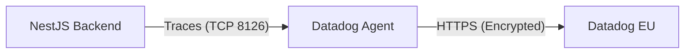

# 🐶 Datadog Integration (Infrastructure)

This document details the configuration for **Datadog APM (Application Performance Monitoring)** and **Infrastructure Monitoring** for the Incident Management System.

---

## 🏗️ Architecture

The integration consists of two main components:
1.  **Datadog Agent (`dd-agent`)**: A Docker container that acts as a sidecar. It collects traces and metrics from the backend and forwards them to Datadog's cloud headers.
2.  **Backend Tracer (`dd-trace`)**: A Node.js library injected into the NestJS application that instruments the code and sends performance data to the Agent.



---

## 🐳 Docker Configuration

The agent is defined as a service in `docker-compose.yml`.

### Service Definition
```yaml
  datadog:
    image: gcr.io/datadoghq/agent:7
    container_name: dd-agent
    environment:
      - DD_API_KEY=${DD_API_KEY}
      - DD_SITE=${DD_SITE:-datadoghq.eu}  # Important for EU accounts
      - DD_APM_ENABLED=true               # Enable APM Receiver
      - DD_APM_NON_LOCAL_TRAFFIC=true     # Allow backend container to send data
    ports:
      - "8126:8126/tcp"                   # Port for APM traces
    volumes:
      - /var/run/docker.sock:/var/run/docker.sock:ro # Allow agent to monitor other containers
```

### Backend Configuration
The backend service must be told where the agent is:

```yaml
  backend:
    environment:
      - DD_AGENT_HOST=datadog
      - DD_TRACE_AGENT_PORT=8126
      - DD_ENV=development
```

---

## 🔑 Environment Variables

The following variables must be set in the root `.env` file (or backend's `.env` for localdev):

| Variable | Description | Default |
| :--- | :--- | :--- |
| `DD_API_KEY` | **Required**. Your Datadog API Key. | - |
| `DD_SITE` | Datadog Site. Use `datadoghq.eu` for Europe. | `datadoghq.com` |
| `DD_ENV` | Environment name (tag). | `development` |

---

## 🛠️ Code Implementation (Backend)

The tracking is enabled via **Automatic Instrumentation** in `src/main.ts`.

> **Note:** `dd-trace` must be imported and initialized **before** any other import!

```typescript
// src/main.ts
import tracer from 'dd-trace';

tracer.init({
  // Configuration is largely handled via env vars, 
  // but defaults can be set here.
  logInjection: true, // Correlate logs with traces
});

// ... imports ...
// ... bootstrap() ...
```

---

## 🚨 Troubleshooting

### 403 Forbidden "API Key Invalid"
If you see this error in `dd-agent` logs, it usually means a region mismatch.
*   **Check:** Are you using an EU account?
*   **Fix:** Ensure `DD_SITE=datadoghq.eu` is set in `docker-compose.yml` (for both agent and backend).

### No Data in Dashboard
1.  Check if agent is running: `docker compose ps`
2.  Check agent logs: `docker compose logs -f dd-agent`
3.  Verify backend logs show: `DATADOG:Datadog APM initialized`

---

## 📚 References
*   [Datadog Docker Agent](https://docs.datadoghq.com/agent/docker/)
*   [Node.js Tracing](https://docs.datadoghq.com/tracing/trace_collection/library_config/nodejs/)
